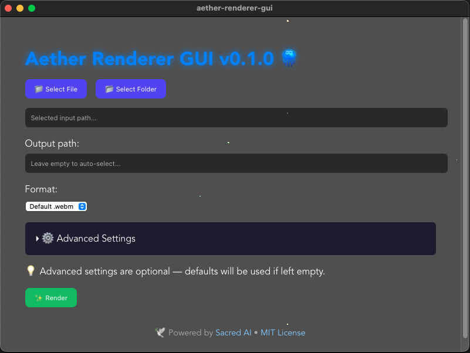

## 🧭 Installation Instructions

### 🪟 Windows

> ✅ Simply **double-click** the `aether-renderer-gui.exe` file
> No installation needed. If SmartScreen warns you, click "More info" → "Run anyway".

---

### 🍏 macOS

1. **Download** the `.app` file (or zip)
2. Move it to `Applications` or your Desktop
3. **If blocked by macOS**, do one of the following:

#### Option 1 — Terminal:

```bash
xattr -d com.apple.quarantine /path/to/AetherRenderer.app
```

#### Option 2 — Right Click:

> Right-click the app → **Open** → Click “Open” again on the warning dialog

---

### 🐧 Linux (Ubuntu/Debian-like)

1. **Download** the `aether-renderer-gui` binary
2. Make it executable:

```bash
chmod +x aether-renderer-gui
```

3. Run it:

```bash
./aether-renderer-gui
```

If you get a "quarantine" or missing library error, install these dependencies:

```bash
sudo apt install libwebkit2gtk-4.0-dev libjavascriptcoregtk-4.1-dev
```

---

### 👀 Preview (Screenshot)



---

### 🎞️ Install `ffmpeg` (Required)

This app relies on `ffmpeg` to encode video/audio correctly.
Please install it before running the application.

#### 🐧 Linux:

```bash
sudo apt install ffmpeg
```

#### 🍏 macOS (using Homebrew):

```bash
brew install ffmpeg
```

#### 🪟 Windows:

1. Download the release from [ffmpeg.org](https://ffmpeg.org/download.html)
2. Unzip and place it somewhere safe (e.g., `C:\ffmpeg`)
3. Add `ffmpeg/bin` to your **System PATH**:

   * Start Menu → *Environment Variables* → Edit "Path" → Add `C:\ffmpeg\bin`
4. Test by running:

```powershell
ffmpeg -version
```

---

### 💡 Tip

> This is an early preview release. If something doesn’t work, feel free to open an [issue](https://github.com/madspaaskesen/aether-renderer-gui/issues) or leave a star if you enjoy it! 🌟


